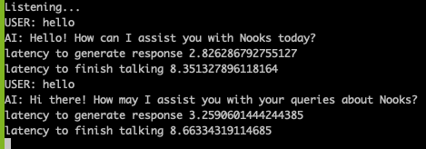
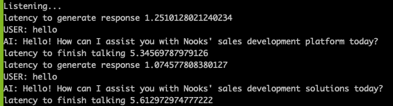

## key decisions
- generating responses async allows us to take advantage of any wait times.
  - ensure we cancel existing process whenever new audio is detected
  - make sure the async process respects the WAIT_TIME set
- streaming data when possible allows us to start generating audio while its still processing the entire response
- just directly killing the mpv process when new text is detected allows us to interrupt the current audio stream
- did not focus on improving the speed of transcribing as it generally took <100ms
  - looked into batching, but it wasn't necessarily more accurate or faster
- some "artificial" improvements of reducing wait time 

## performance stats

## other considerations/routes I would explore given more time
- in the best case, we stream responses from OpenAI and feed it directly into ElevenLabs (since it can take in a generator)
- more elegant way to interrupt audio
  - I tested with interrupting while streaming, but naively it will still attempt to finish the sentence its on
- disregard certain audio chunks under a certain energy level
  - there's a lot of nuance in terms of how transcribe_chunk works. It seems like even low energy level audio chunks are useful for the STT transcriber
- changing audio inputs to increase quality. this potentially requires more in-depth knowledge with regards to audios and human speech patterns (ie. optimal wait time, necessary quality, etc).

  
## feedback
- ran into a bunch of setup issues, downgrading to python 3.11 made it work
- app takes an annoying amount of time to load, didn't have a chance to look into any improvements
- seemed like there were some audio quality issues and I'm unsure if it's within the scope of the problem